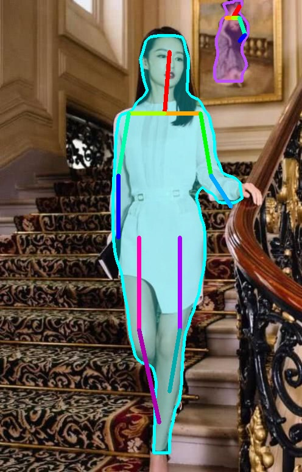
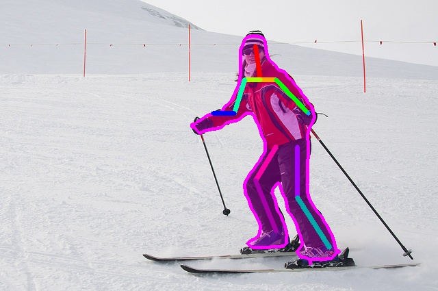

# MaskRCNN-Keypoint-Demo

基于keras实现的简单的人体关键点图片分割MaskRCNN

# Requirements
* Python 3.4+
* TensorFlow 1.3+
* keras 2.0.8+
* numpy, skimage, scipy, Pillow, cython, h5py
* cocoapi: `pip3 install "git+https://github.com/philferriere/cocoapi.git#egg=pycocotools&subdirectory=PythonAPI"`
* cv2: `pip3 install opencv-python`

# Run in local
$ cd MaskRCNN-Keypoint-Demo
```
download the **pre-trained model**([baiduyun](https://pan.baidu.com/s/1C3o10VclGQy42UZu2dsl1w),[dropbox](https://www.dropbox.com/s/5ctrg3br94srrx9/mask_rcnn_coco.h5)) in the MaskRCNN-Keypoint-Demo folder.

finally, you have two choices:
```bash
$ python3 main.py --image path/to/image
```
or
```bash
$ python3 main.py --video path/to/video
```
Example:
```
$ python3 main.py --image media/ski.jpg
$ python3 main.py --image media/liqin.jpg
```








作者微信联系：RunsenLiu